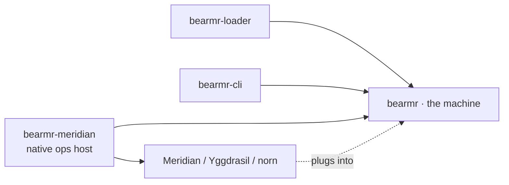

# 12 · The Crate Structure — Where Everything Lives

*This is the map: where each bit from the other docs actually lives on disk, and —
more importantly — **why** the boundaries fall where they do. The folder layout is
downstream of one rule, so the rule comes first.*

## The one rule

**bearmr depends on nothing of Meridian's. Meridian depends on bearmr.** The machine
is a self-contained thing that knows how to load and run bytecode and call functions
you hand it. It does *not* know what git is, what Yggdrasil is, or what a diagnostic
is. Those live *outside* and plug *in*. Follow this and the machine stays testable on
its own and you never get a dependency knot.



Everything points *toward* the core. Nothing points out of it.

## The workspace

```
bearmr/
  Cargo.toml                 # the workspace
  docs/                      # these documents
  crates/
    bearmr/                  # the machine itself
    bearmr-loader/           # reading .beam files
    bearmr-cli/              # a thin way to run one by hand
    bearmr-meridian/         # (later) your Rust ops, registered as natives
```

Three crates to start, a fourth when it's earned. Why split at all, instead of one
big crate? Because these have genuinely different jobs and different reasons to
change — and two of them are independently testable in isolation, which is worth a
lot when you're verifying correctness with an army of agents.

### `bearmr-loader` — split off from day one

Reading `.beam` files is a *pure input* job: bytes in, a runnable module out. It
touches none of the runtime. That makes it the one early split that pays for itself
immediately — you can hammer it against real files from `gleam build` and snapshot
exactly what it decodes, with the whole rest of the machine absent. It owns docs
**01 (atoms, the table it fills)** and **02 (loader)**.

### `bearmr` — the machine

The heart. Everything that *runs*. Internally it's organised by the bits:

```
crates/bearmr/src/
  term            # 03 · what data is made of
  process         # 04 · the unit of life
  interpreter     # 05 · the execution loop + reduction counting
  scheduler       # 06 · run queues, work stealing, the dirty pool
  memory + gc     # 07 · per-process heaps and collection
  mailbox         # 08 · messages and selective receive
  supervision     # 09 · links, monitors, exit signals
  native          # 10 · the registry that lets outside Rust plug in
  hook            # 11 · the reduction-boundary seam Meridian listens on
```

These are modules, not separate crates, *on purpose*. They're tightly woven — the
interpreter touches terms, the heap, the scheduler, the mailbox constantly — and
prying them into separate crates early would just add ceremony to every change. Let
the seams prove themselves first; split later only where one genuinely hardens into
a standalone concern.

### `bearmr-cli` — the thin runner

A small program: point it at a `.beam`, register a few natives, run it, see what
happens. Binaries should be thin shells over library crates, so this stays tiny. Its
real value is early: it's how you *watch the machine work* before Meridian is wired
in. (Worth asking yourselves: once the point is in-process hosting by norn, does the
CLI matter beyond bring-up? Maybe it's a scaffold you keep, maybe it's disposable.)

### `bearmr-meridian` — the plug (later)

Where your actual operations — git, AST-merge, graph, diagnostics calls — get
registered as natives (doc 10). It depends on *both* bearmr and Meridian, which is
precisely why it's its own crate: it's the join, and the join shouldn't contaminate
either side. This is also where the reduction-boundary hook (doc 11) gets wired to
norn's conventions engine.

## The reading order, mapped to the build order

The docs are numbered the way the system makes *sense*; the crates get built in
roughly the same order the proof-of-life needs them: loader first (you can't run
nothing), then term + interpreter (run one function), then scheduler + processes +
mailbox (run many, fairly, talking), then GC (run them for a long time), then
supervision (let them crash safely), then natives + the hook (make it Meridian's).
